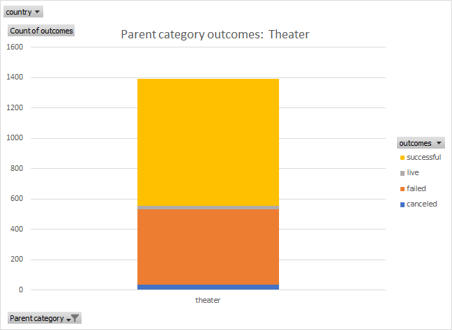

# Kickstarting with Excel
[Excel data file](Kickstarter_Challenge.zip)  
## Overview of Project  
### Purpose of the analysis  
The purpose is to use data on Kickstarter funding campaigns, launched from 2009 to 2017, to provide insights into the client's campaign to fund the play "Fever."  The client wants to understand how the launch date for theater funding campaigns relates to the success rate and the relationship between the funding goal and the success of the campaign. 
## Analysis and Challenges  
The initial data set has 4,414 campaigns.  1,393 of the campaigns were for theater productions.  
  
  
  
  
  
### Analysis steps  
1. Extract the campaign launch year from the campaign launch date using the YEAR function in Excel.  
- =YEAR()
- The campaign launch date was calculated from the raw UNIX date stamp.  
-   
2. Create a line graph of the Theater campaign outcomes vs month.  
- Create a pivot table with the rows as months and the columns with counts of the outcomes of the campaigns.  
- Use the years calculated in #1 and the parent category as filters.
- Create a pivot line chart from the pivot table showing the number of theater campaigns that were successful, failed, and were canceled.  
3. Create a line graph showing the percentage succecss and failure rates of theater campaigns  
- Create the summary table below using the COUNTIFS function in Excel.  COUNTIFS allows multiple boolean conditions to determine if a cell should be included in the count.  
  
- The table is used to create a line graph showing the percentage of thearer campaign failures and successes on the y axis and the binned gunding goals on the x axis.  
  
### Challenges  

There are numerous graphs and tables that I could make to address this project.  However, I have difficulty evaluating the statistical significance of the additional looks at the data.  As an example, it could be interesting to look at the Plays outcomes by Launch date for 2016 and 2017 to see the most recent data but is the data set large enough to be meaningful?  
  
### Analysis of Outcomes Based on Launch Date  
  
  
  
The line graph is a pivot chart created from the pivot table below.  

  

### Analysis of Outcomes Based on Goals  
  
  
  
The line graph data is in this data table  
  
  
  
### Challenges and Difficulties Encountered  
  
The analysis was fairly straight forward in terms of using Excel.  
The most difficult aspect of the Excel analysis was formatting the Theater outcomes based on launch date with rows as months.  It was a matter of trial and error to determine which fields to remove from the Rows to get the correct format.  

## Results

- What are two conclusions you can draw about the Outcomes based on Launch Date?  
  
1. May through August have the most theater kickstarter campaigns and the highest ratio of successful to failed campaigns.  This is the best time to launch a funding campaign.

2. There tends to be a spike in theater funding campaigns in October but most of the increase are failures.  
  
- What can you conclude about the Outcomes based on Goals?  
  
1. In general, there is a negative relationship between the funding goal and the success rate.  
  
2. There is a reversal in this trend for campaigns between $35,000 and $45,000.  It is unclear what drives this reversal  
  
- What are some limitations of this dataset?  
  
1. In it's current form the data do not shed light on relationships between the kinds of plays and their success rate.  Extracting data from the blurbs could show that one type of play is more successful than another in being funded.  
2. Havng spatial information could make the interpretations more meaningful.  As an example, do campaigns in big cities have better results than campaigns in rural areas?    
  
- What are some other possible tables and/or graphs that we could create?  
  
1. Line graph of the percent of goal funded vs the length of the campaign.  
2. Theater campaign outcomes based on launch year to understand how changes in the economy over time have impacted both the number of campaigns initiated and fully funded.  

